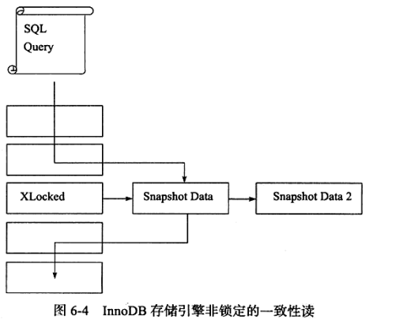

# 一致性非锁定读

### 什么是一致性非锁定读

**一致性非锁定读**（Consistent NonLocking Read）是指通过**多版本控制**(Multiversion Concurrency Control )的方式来读取当前时间数据库中的行。这也是InnoDB存储引擎在Read Commit和Repeatable Read隔离级别下的默认读方式。

如果当前读取操作要读取的行正执行DELETE/UPDATE操作，则当前读取操作不会去等待行上锁的释放，而是去读取行的快照数据（Snapshot）。如下图所示：



快照数据是指当前行之前版本的数据，快照数据是通过undo日志来实现的。

### 一致性非锁定读与事务隔离级别

在InnoDB中共有四种隔离级别，分别是：`Read Uncommit`，`Read Commit`，`Repeatable Read`和`Seriable`。 在事务隔离级别为`Read Commit`和`Repeatable Read`下，InnoDB会采用MVCC方式去处理读操作。

由于`Read Commit`和`Repeatable Read`隔离级别不一致，所以两者读取的快照数据也不一样。总的来说为：

* `Read Commit`会读取被锁定行的最新的快照数据；
* `Repeatable Read`会读取当前事务开始时的快照数据；

 #### 举个例子
 
Person表数据为：

| name          |
| ------------- |
| john          | 


现在开启事务A，隔离级别未知，然后读取数据，但不提交事务：
```sql
# 事务A
BEGIN
select * from Person;
```
读取的数据为name=john，然后我们开启事务B去修改记录，不提交事务：

```sql
# 事务B
BEGIN
update Person set name = "jack";
```

此时，我们再在用事务A去读取记录，`Read Uncommit`、`Read Commit`和`Repeatable Read`读取数据如下：

| Read Uncommit |Read Commit    | Repeatable Read  |
| ------------- |:-------------:| ----------------:|
| name=jack     | name=john     | name=john        |

Read Uncommit不在我们的讨论范围内，这里只是做个对比。可以看到Read Commit和Repeatable Read读取的数据都是一样的：name=john，然后我们将事务B提交：

```sql
# 事务B
COMMIT
```

最后事务A再读取记录，不同事务隔离级别结果如下：

| Read Uncommit |Read Commit    | Repeatable Read  |
| ------------- |:-------------:| ----------------:|
| name=jack     | name=jack     | name=john        |


发现`Read Commit`读取了最新提交的快照数据，而`Repeatable Read`读取的仍是事务开始读取的快照数据，也就是name=john。

